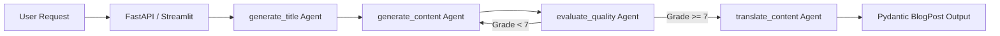

# Multi-Agent Blog Generation Engine

[](https://www.python.org/downloads/)
[](https://fastapi.tiangolo.com/)
[](https://github.com/langchain-ai/langgraph)
[](https://streamlit.io/)
[](LICENSE)

A production-grade Multi-Agent Blog Generation and Localization Service powered by FastAPI, LangGraph, Groq LLMs, and Streamlit. Generates SEO-optimized titles, drafts structured technical posts, evaluates readability quality, and dynamically translates content into target languages using Pydantic structured outputs.

---

## Key Features

- **FastAPI REST Service:** Asynchronous `/api/v1/blogs` endpoint with full OpenAPI Swagger documentation (`/docs`).
- **Multi-Agent LangGraph Workflow:** Dedicated agents for SEO title drafting, deep content synthesis, quality evaluation, and language localization.
- **Corrective Quality Evaluator:** Automated quality grading node checking length, markdown structure, and formatting before translation.
- **Dynamic Multilingual Support:** Translates technical content into requested target languages while preserving tone and formatting.
- **Streamlit Dashboard:** Interactive web client supporting live generation and direct Markdown download.
- **Docker & Docker-Compose Setup:** Multi-container orchestration powering both API and UI services seamlessly.

---

## Multi-Agent Architecture



---

## Quick Start

### Installation

1. **Clone the repository:**
   ```bash
   git clone https://github.com/Hamza-HATTAB/blog-generation-engine.git
   cd blog-generation-engine
   ```

2. **Set up virtual environment & install dependencies:**
   ```bash
   python3 -m venv .venv
   source .venv/bin/activate
   pip install -e .
   ```

3. **Configure environment variables:**
   ```bash
   cp .env.example .env
   # Add your GROQ_API_KEY to .env
   ```

4. **Launch REST API Server:**
   ```bash
   uvicorn api:app --reload --port 8000
   ```
   *Access Interactive Swagger Docs at `http://localhost:8000/docs`*

5. **Launch Streamlit App (optional):**
   ```bash
   streamlit run app.py
   ```

---

## Testing

Execute automated unit and integration test suite:

```bash
pytest tests/
```

---

## Docker Deployment

Run both API and UI with Docker Compose:

```bash
docker-compose up --build
```

---

## License

Distributed under the MIT License. See `LICENSE` for more information.
